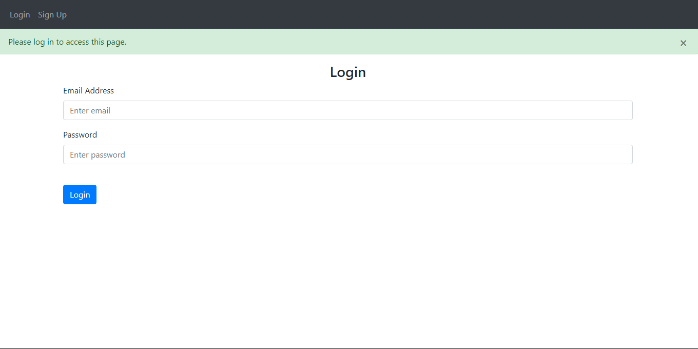
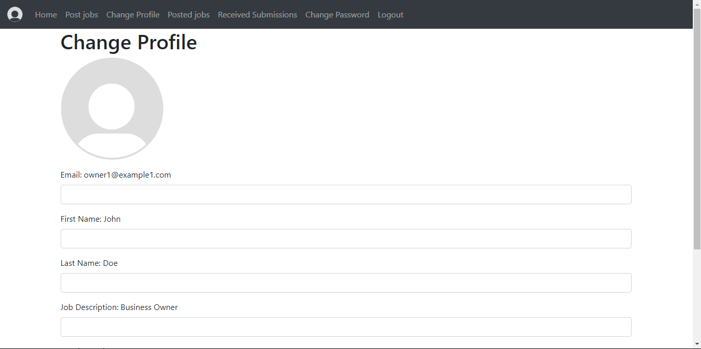
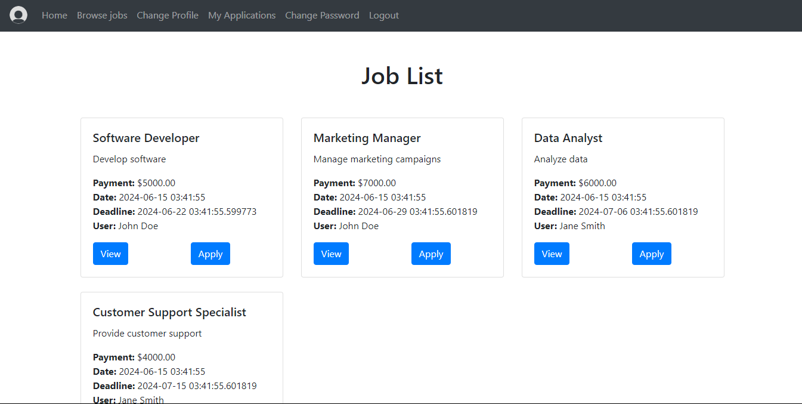
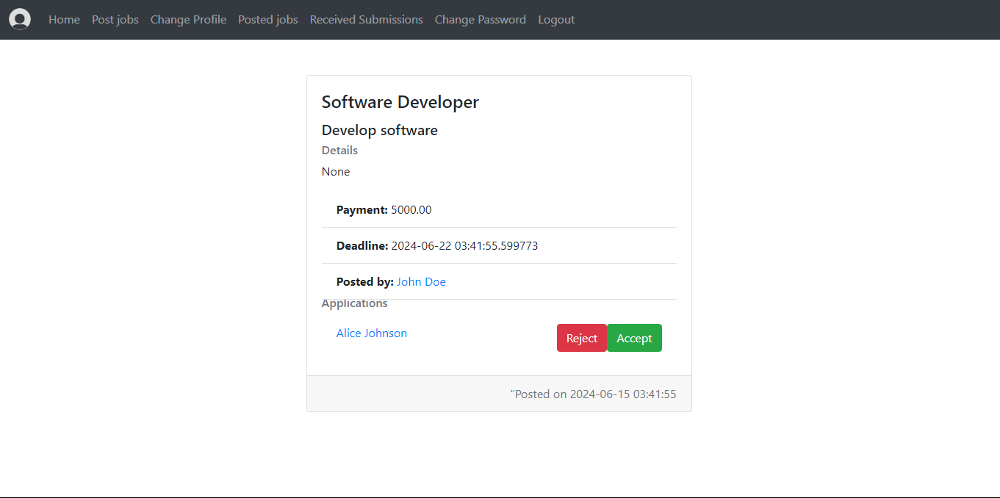
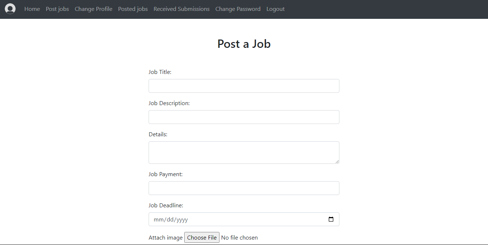

# Shaghalni

## Introduction
This is a freelancing platform built using Flask. deployed using azure pipelines and docker. utilized testing using pytest and selenium.\\
The UI is made using jinja templates and bootstrap. \\
The backend is made using flask and flask-sqlalchemy.

## Features
- User authentication
- User profile management
- Job posting and bidding
- Payment processing

## Screenshots








## Installation
1. Clone the repository
2. Make sure python 3.8+ is installed
3. install the requirements

```bash
pip install -r requirements.txt
```

## Usage
1. Register a new account or login to an existing one
2. Create a new job posting or bid on an existing one
3. Wait for the job owner to accept your bid or accept a bid from a freelancer if you are the job owner
4. Complete the job and receive payment

## Contributors
- Ezzat Eisawy
- Omar El-Sakka

## License
This project is licensed under the MIT License - see the [LICENSE](LICENSE) file for details

## How to run it (Run the main.py file)

```bash
python main.py
```

### Viewing The Wesite

Go to `http://127.0.0.1:80`
